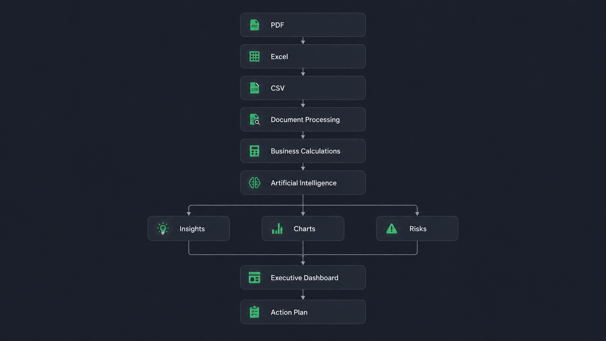
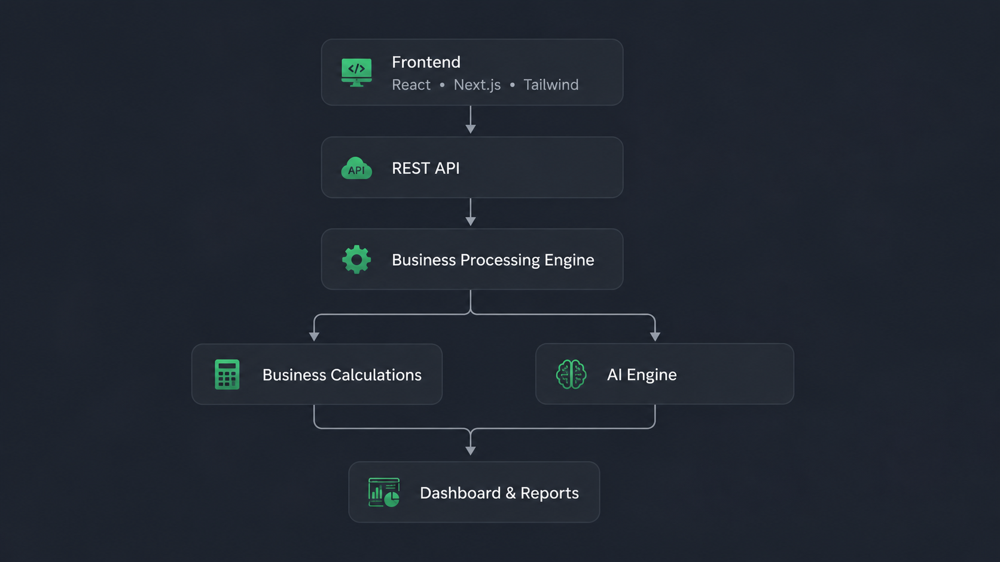
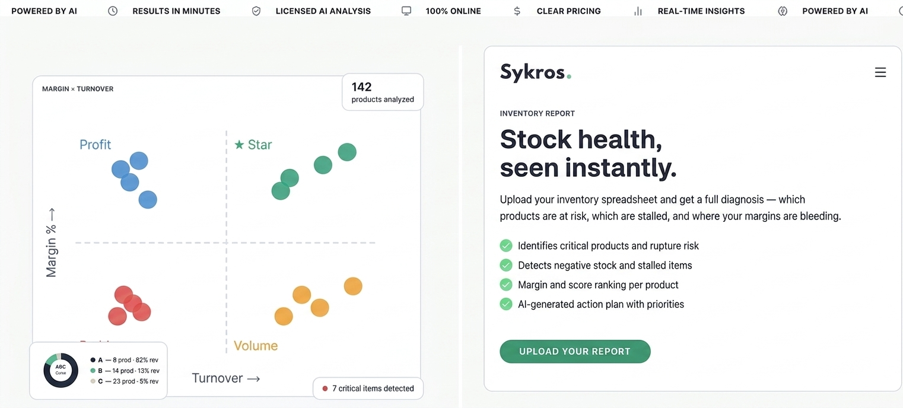
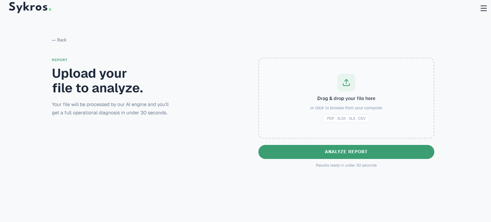
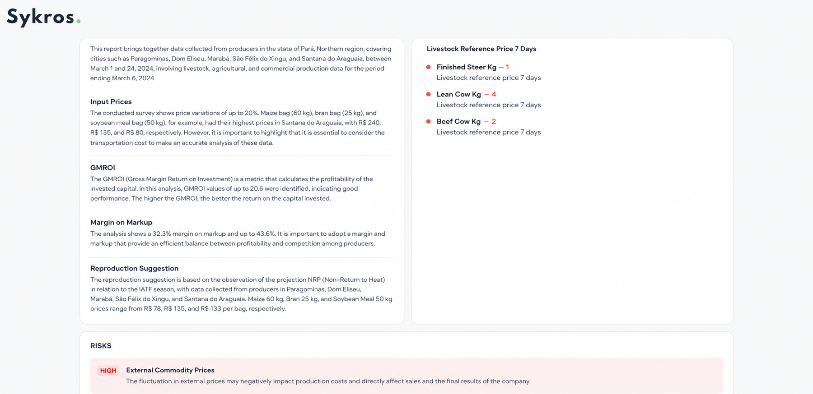
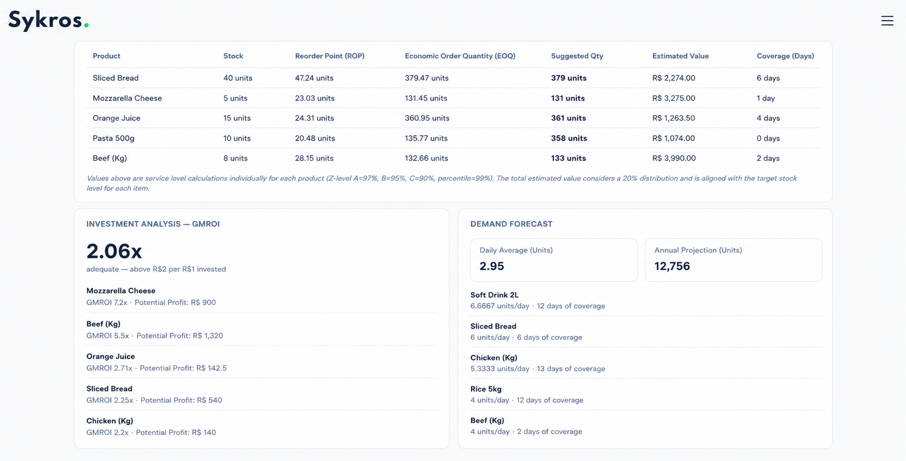
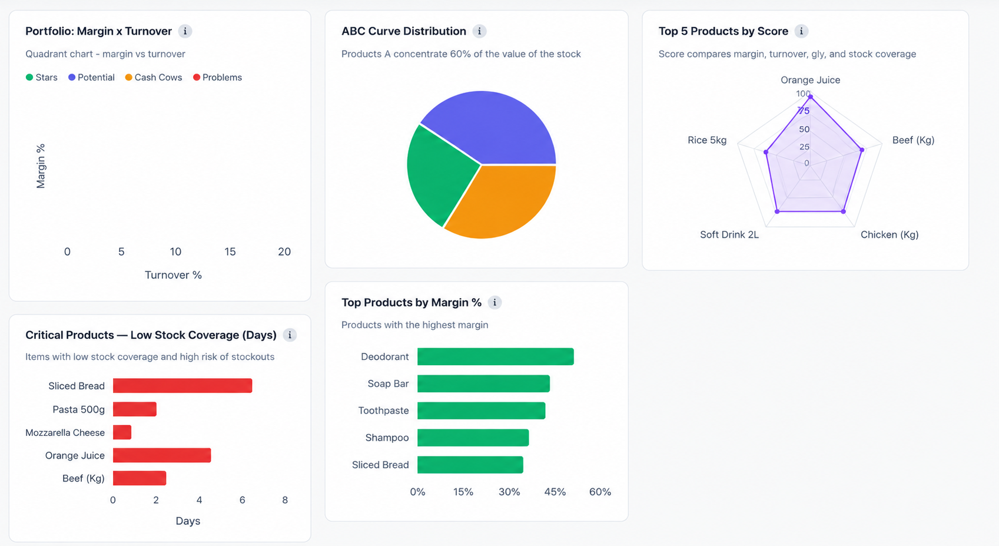
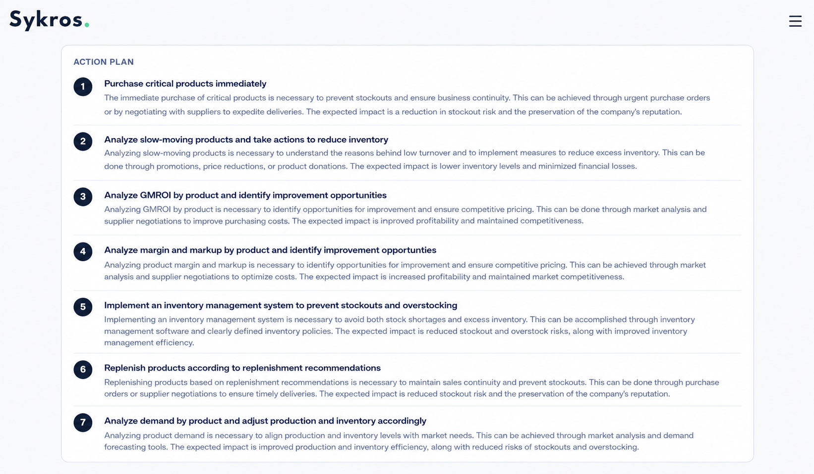

### Business Intelligence Platform

> Transform business reports into strategic decisions using Artificial Intelligence.

---

# About

Sykros is an AI-powered Business Intelligence SaaS designed for small and medium-sized businesses.

The platform transforms operational and financial reports into intelligent dashboards, business insights, executive summaries, and actionable recommendations.

Users simply upload their reports in PDF, Excel, or CSV format, and the platform automatically processes the data, calculates key business indicators, generates AI-driven analyses, and presents strategic recommendations through an intuitive dashboard.

---

# Workflow

---

# Features

- 📂 Upload PDF, Excel and CSV reports
- 🤖 AI-powered business analysis
- 📊 Executive dashboards
- 📈 AI-recommended charts
- 📋 Action plans based on business data
- 📑 Executive summaries
- 📉 Financial KPI calculations
- 📦 Inventory analytics
- 📊 Performance comparisons
- ⚠️ Risk identification
- 💡 Strategic recommendations

---

# Business Analytics

Sykros automatically calculates dozens of operational and financial indicators, including:

### Financial

- Profit Margin
- Gross Profit
- Net Profit
- ROI
- Revenue Analysis
- Cost Analysis

### Inventory & Operations

- Gross-Margin-Return-on-Inventory-Investment (GMROI)
- Inventory-Turnover
- Inventory-Coverage
- Safety-Stock
- Reorder-Point (ROP)
- Economic-Order-Quantity (EOQ)
- ABC-Analysis
- Performance-Over-Time

---

# Artificial Intelligence

Artificial Intelligence is responsible for:

- Interpreting business indicators
- Detecting operational risks
- Explaining KPI performance
- Recommending the best charts
- Generating executive reports
- Creating personalized action plans
- Producing strategic insights
- Supporting management decision making

---

# Architecture

---

# Tech Stack

## Frontend

- React
- Next.js
- TailwindCSS
- TypeScript

## Backend

- Python
- Flask

## Artificial Intelligence

- OpenAI
- Anthropic Claude
- Groq

## Data Processing

- PDF Parsing
- Excel Processing
- CSV Processing

## Charts

- Recharts

## Version Control

- Git
- GitHub

---

# Screenshots

## Dashboard

---

## Upload

---

## AI Analysis

---

## Executive Report

---

## Charts

---

## Action Plan

---

# My Role

**Co-owner & Full Stack Developer**

Responsible for the complete development of the platform, including:

- System Architecture
- Front-end Development
- Back-end Development
- Business Logic
- AI Integration
- Dashboard Development
- Report Processing
- Database Design
- User Experience (UX)
- API Development
- Product Engineering

---

# Project Goals

Sykros was created to simplify business decision-making by combining operational metrics, artificial intelligence, and data visualization into a single platform.

The objective is to reduce the time managers spend interpreting reports while improving strategic planning through automated insights.

---

# Roadmap

- ✅ Authentication
- ✅ Dashboard
- ✅ Report Upload
- ✅ AI Analysis
- ✅ Business Calculations
- ✅ KPI Generation
- ✅ Executive Reports
- ✅ Action Plans
- 🚧 Multi-company Support
- 🚧 PDF Export
- 🚧 Advanced Comparative Analytics
- 🚧 Public API

---

# Proprietary Software

This repository showcases the product documentation and project overview.

The source code remains private because Sykros is proprietary commercial software.

If you are interested in discussing the technical architecture or development process, feel free to contact me.

---

# License

Copyright © 2026 Julio Cesar Oliveira.

All Rights Reserved.

The source code of this software is proprietary and is not publicly available.

No part of this project may be copied, redistributed, modified, or reused without explicit permission from the author.
